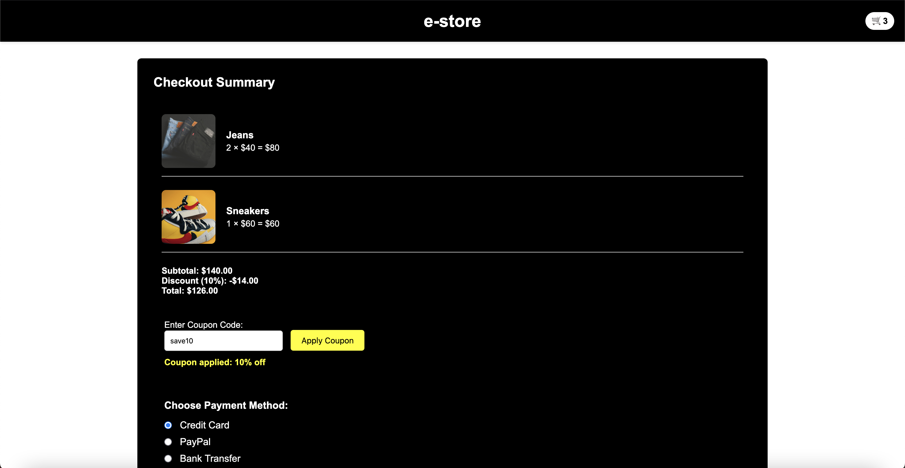

# Mini E-Store

Welcome to the Mini E-Store! This project is a simple e-commerce website where users can browse products, add them to the cart, and proceed to checkout.

## Features

- **Product Browsing**: View available products in a grid format.
- **Cart Management**: Add, update, and remove items from the shopping cart.
- **Checkout**: See a summary of your cart, apply coupons, and view the total.
- **Coupon Support**: Apply different discount codes at checkout.

## Screenshots

Here are a couple of screenshots showcasing the layout and functionality:

### Product Page

### Shopping cart

### Checkout

## Contributing

1. Fork the repository.
2. Create a new branch: `git checkout -b feature-branch`.
3. Make your changes and commit: `git commit -am 'Add new feature'`.
4. Push to your branch: `git push origin feature-branch`.
5. Open a pull request.
